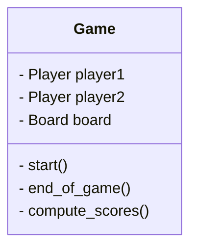
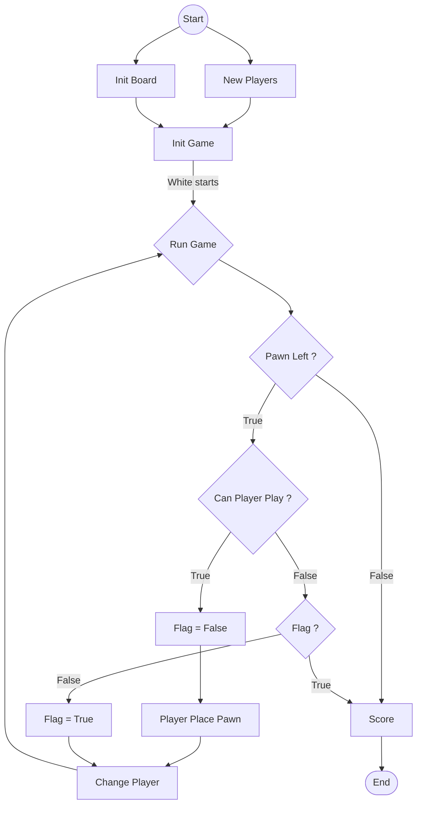

# Othello Game Architecture Document

```mermaid
classDiagram
class Game{
    - Player player1
    - Player player2
    - Board board
    - start()
    - end_of_game()
    - compute_scores()
}
```

```mermaid
flowchart TD

    Start((Start))
    End([End])

    Init_Players[New Players]
    Init_Board[Init Board]
    Init_Game[Init Game]

    Run_Game{Run Game}

    Pawn_Left{Pawn Left ?}
    Can_Player_Play{Can Player Play ?}
    Player_Place_Pawn[Player Place Pawn]
    Change_Player[Change Player]

    Was_Flag_True{Flag ?}
    Make_Flag_False[Flag = False]
    Make_Flag_True[Flag = True]
    Count_Score[Score]

    Start --> Init_Players
    Start --> Init_Board
    Init_Players & Init_Board --> Init_Game
    Init_Game --> |White starts| Run_Game


    Run_Game -->  Pawn_Left
    Pawn_Left --> |True| Can_Player_Play
    Pawn_Left --> |False| Count_Score

    Can_Player_Play --> |True| Make_Flag_False
    Make_Flag_False --> Player_Place_Pawn
    Player_Place_Pawn --> Change_Player
    
    Can_Player_Play --> |False| Was_Flag_True 
    Was_Flag_True --> | True | Count_Score 
    Was_Flag_True --> |False| Make_Flag_True
    Make_Flag_True -->  Change_Player

    Change_Player --> Run_Game
    
    Count_Score --> End

```

https://support.typora.io/Draw-Diagrams-With-Markdown/